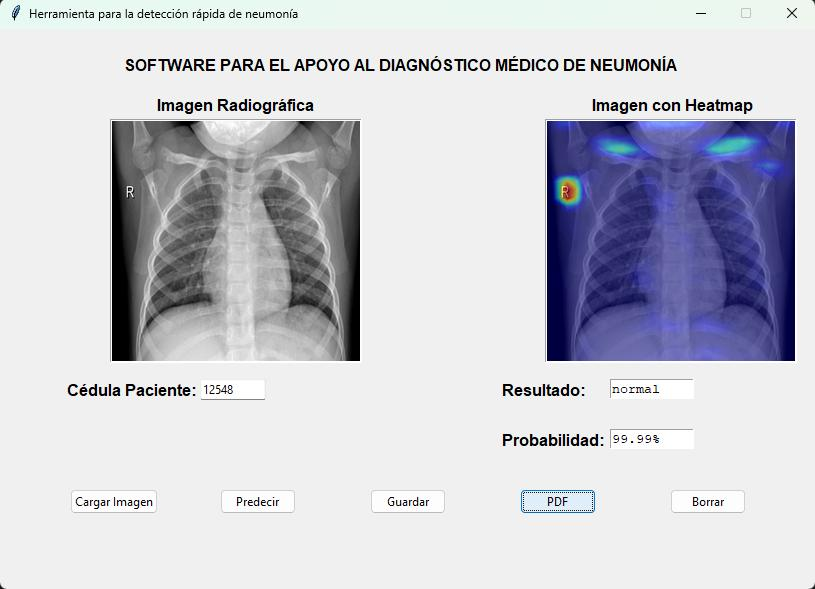

# Detector de Neumonía con IA
```bash
Sistema de apoyo al diagnóstico médico de neumonía utilizando Inteligencia Artificial para el análisis de imágenes radiográficas.
```

## Descripción
```bash
Este proyecto implementa una aplicación de escritorio que utiliza redes neuronales convolucionales para detectar y clasificar casos de neumonía a partir de imágenes radiográficas. El sistema puede distinguir entre neumonía bacteriana, viral y casos normales, proporcionando además visualizaciones de las áreas de interés mediante mapas de calor (Grad-CAM).
```

## Características

```bash
- Interfaz gráfica intuitiva
- Soporte para imágenes DICOM y formatos comunes (JPG, PNG)
- Visualización de mapas de calor con Grad-CAM
- Generación de reportes en PDF
- Historial de predicciones en CSV
```




## Requisitos del Sistema
```bash
- Python 3.11.4
- Sistema Operativo: Windows 10/11, Linux o macOS
- RAM: Mínimo 8GB (Recomendado 16GB)
- Espacio en disco: 2GB mínimo
```

## Instalación

### 1. **Clonar el repositorio**
```bash
git clone https://github.com/daplaza82/UAO-Neumonia.git
cd UAO-Neumonia
```

### 2. **Crear y activar entorno virtual**
```bash
# Windows
python -m venv venv
.\venv\Scripts\activate

# Linux/macOS
python -m venv venv
source venv/bin/activate
```

### 3. **Instalar dependencias**
```bash
pip install -r requirements.txt
```

### 4. **Preparar el modelo**
```bash
- Coloca el archivo del modelo (`conv_MLP_84.h5`) en la carpeta `models/`
```

## Uso

### Ejecutar la aplicación

```bash
python main.py
```

### Ejecutar pruebas

```bash
# Ejecutar todas las pruebas
pytest tests/

# Ejecutar pruebas específicas
pytest tests/test_preprocess.py
pytest tests/test_read_img.py

# Ejecutar pruebas con cobertura
pytest --cov=src tests/
```

### Usando Docker

```bash
# Configuración inicial para que funcione la interfaz gráfica del contenedor en Windows
1 Instalar VcXsrv Windows X Server:
  - Descarga VcXsrv desde: https://sourceforge.net/projects/vcxsrv/
  - Instálalo con las opciones por defecto

2 Configurar VcXsrv:
  - Ejecuta XLaunch (programa que viene con VcXsrv)
  - En la primera pantalla, selecciona "Multiple windows"
  - En "Display number" pon: 0
  - Click "Next"
  - Selecciona "Start no client"
  - Click "Next"
  - Marca todas las casillas en "Extra settings":
     * Clipboard
     * Primary Selection
     * Native opengl
     * Disable access control
  - Click "Next" y luego "Finish"

3  Modificar PowerShell para configurar la variable DISPLAY:
   $env:DISPLAY = "host.docker.internal:0.0"

```

```bash
# Construir la imagen
docker build -t detector-neumonia .

# Ejecutar el contenedor con las opciones necesarias
docker run --rm -e DISPLAY=host.docker.internal:0.0 detector-neumonia
```

### Estructura del Proyecto
```
UAO-Neumonia/
├── src/               # Código fuente
│   ├── gui/           # Interfaz gráfica
│   │   ├── app.py     # ejecuta la Interfaz gráfica
│   ├── read_img.py    # Lectura de imágenes
│   ├── preprocess_img.py  # Preprocesamiento
│   ├── load_model.py  # Carga del modelo
│   ├── grad_cam.py    # Visualización
│   └── integrator.py  # Integración
├── test_images/       # Imagenes de muestra a predecir
│   ├── dicom/         # Para imágenes DICOM
│   └── jpg/           # Para imágenes JPG
├── tests/             # Pruebas unitarias
├── models/            # Modelos entrenados
└── requirements.txt   # Dependencias
```

### Uso de la Interfaz Gráfica:
```bash
- Ingrese la cédula del paciente en la caja de texto
- Presione el botón 'Cargar Imagen', seleccione la imagen de la carpeta incluida en el proyecto (`test_images`)
- Presione el botón 'Predecir' y espere unos segundos hasta que observe los resultados
- Presione el botón 'Guardar' para almacenar la información del paciente en un archivo excel con extensión .csv
- Presione el botón 'PDF' para descargar un archivo PDF con la información desplegada en la interfaz
- Presión el botón 'Borrar' si desea cargar una nueva imagen
---
```

## Arquitectura de archivos.

### app.py
```bash
Contiene el diseño de la interfaz gráfica utilizando Tkinter.

Los botones llaman métodos contenidos en otros scripts.
```

### integrator.py
```bash
Es un módulo que integra los demás scripts y retorna solamente lo necesario para ser visualizado en la interfaz gráfica.
Retorna la clase, la probabilidad y una imagen el mapa de calor generado por Grad-CAM.
```

### read_img.py
```bash
Script que lee la imagen en formato DICOM para visualizarla en la interfaz gráfica. Además, la convierte a arreglo para su preprocesamiento.
```

### preprocess_img.py
```bash
Script que recibe el arreglo proveniento de read_img.py, realiza las siguientes modificaciones:

- resize a 512x512
- conversión a escala de grises
- ecualización del histograma con CLAHE
- normalización de la imagen entre 0 y 1
- conversión del arreglo de imagen a formato de batch (tensor)
```

### load_model.py
```bash
Script que lee el archivo binario del modelo de red neuronal convolucional previamente entrenado llamado 'WilhemNet86.h5'.
```

### grad_cam.py
```bash
Script que recibe la imagen y la procesa, carga el modelo, obtiene la predicción y la capa convolucional de interés para obtener las características relevantes de la imagen.
```


## Acerca del Modelo
```bash
La red neuronal convolucional implementada (CNN) es basada en el modelo implementado por F. Pasa, V.Golkov, F. Pfeifer, D. Cremers & D. Pfeifer
en su artículo Efcient Deep Network Architectures for Fast Chest X-Ray Tuberculosis Screening and Visualization.

Está compuesta por 5 bloques convolucionales, cada uno contiene 3 convoluciones; dos secuenciales y una conexión 'skip' que evita el desvanecimiento del gradiente a medida que se avanza en profundidad.
Con 16, 32, 48, 64 y 80 filtros de 3x3 para cada bloque respectivamente.

Después de cada bloque convolucional se encuentra una capa de max pooling y después de la última una capa de Average Pooling seguida por tres capas fully-connected (Dense) de 1024, 1024 y 3 neuronas respectivamente.

Para regularizar el modelo utilizamos 3 capas de Dropout al 20%; dos en los bloques 4 y 5 conv y otra después de la 1ra capa Dense.
```

## Acerca de Grad-CAM
```bash
Es una técnica utilizada para resaltar las regiones de una imagen que son importantes para la clasificación. Un mapeo de activaciones de clase para una categoría en particular indica las regiones de imagen relevantes utilizadas por la CNN para identificar esa categoría.

Grad-CAM realiza el cálculo del gradiente de la salida correspondiente a la clase a visualizar con respecto a las neuronas de una cierta capa de la CNN. Esto permite tener información de la importancia de cada neurona en el proceso de decisión de esa clase en particular. Una vez obtenidos estos pesos, se realiza una combinación lineal entre el mapa de activaciones de la capa y los pesos, de esta manera, se captura la importancia del mapa de activaciones para la clase en particular y se ve reflejado en la imagen de entrada como un mapa de calor con intensidades más altas en aquellas regiones relevantes para la red con las que clasificó la imagen en cierta categoría.
```

## Autores

* David Plaza C - https://github.com/daplaza82
* **Proyecto original realizado por:**
* Isabella Torres Revelo - https://github.com/isa-tr
* Nicolas Diaz Salazar - https://github.com/nicolasdiazsalazar


## Licencia

Este proyecto está bajo la Licencia MIT - ver el archivo [LICENSE](LICENSE) para más detalles.


## Agradecimientos

* [UAO](https://www.uao.edu.co/) - Universidad Autónoma de Occidente
* Jan Polanco Velasco/Docente


## Contacto

David Plaza C -  daplaza82@gmail.com

Link del Proyecto: [https://github.com/daplaza82/UAO-Neumonia](https://github.com/daplaza82/UAO-Neumonia)
